# Actividad 11 - desarrollada en clase de manera grupal: Gestión ágil de proyectos con GitHub Projects, configuración de Kanban Board y creación de historias de usuario

* **Repositorio:** [Repositorio de GitHub](https://github.com/EdySerrano/Desarrollo_de_software-2025-2)
* **Proyecto Kanban:** [Tablero de GitHub Projects](https://github.com/users/EdySerrano/projects/7)

## Parte 1: Kanban Board
* **Tablero inicial:** Captura de "Devops-agile" con columnas predeterminadas.

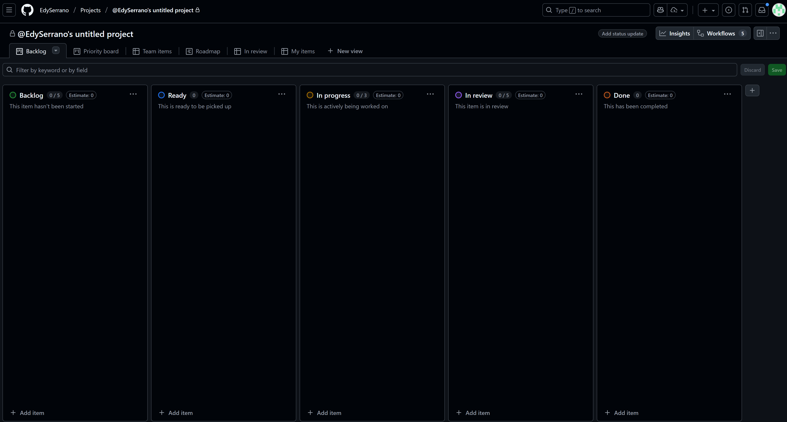

* **Columnas renombradas:** 
    * Ready -> Icebox
    
    

    * In Review -> Review/QA.

    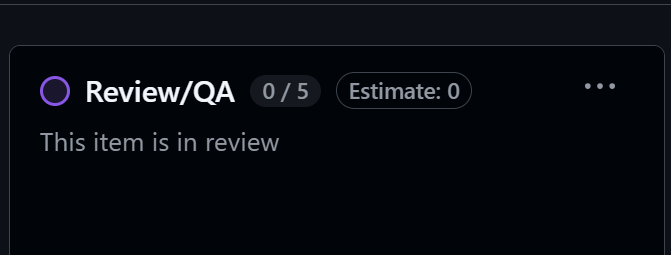

* **Tablero final:** Columnas Product Backlog y Sprint Backlogs, orden correcto.

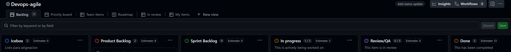

## Parte 2: Issue template
* **Configuración:** *Settings > Features > Custom template.*

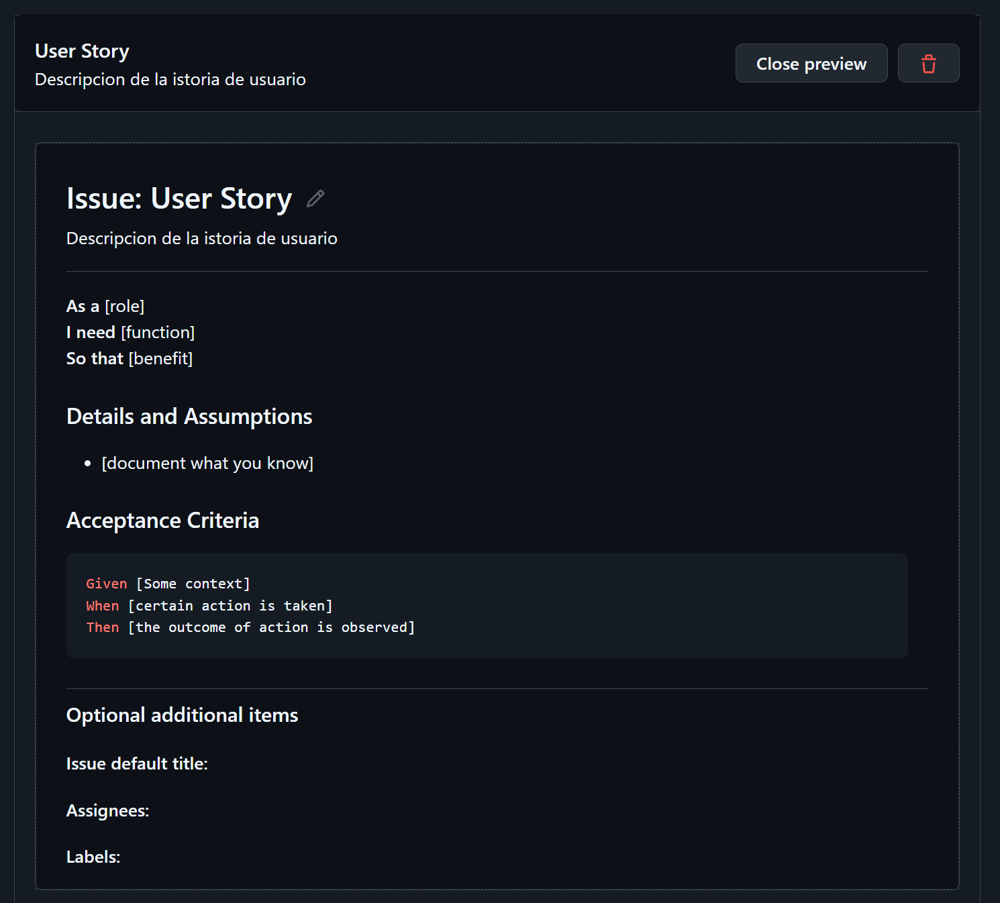

* **Template User Story:** Markdown de ejemplo.
    * **Enlace:** [.github/ISSUE_TEMPLATE/user-story.md](https://github.com/EdySerrano/Desarrollo_de_software-2025-2/blob/main/.github/ISSUE_TEMPLATE/user-story.md)

    * **Commit:** 

    

## Parte 3: Historias de usuario
* **7 Issues:**
    * **Enlaces:** 
        * [Counter](https://github.com/EdySerrano/Desarrollo_de_software-2025-2/issues/1)
        * [Multiple-Counters](https://github.com/EdySerrano/Desarrollo_de_software-2025-2/issues/2)
        * [Persist](https://github.com/EdySerrano/Desarrollo_de_software-2025-2/issues/3)
        * [Reset](https://github.com/EdySerrano/Desarrollo_de_software-2025-2/issues/4)
        * [Deploy](https://github.com/EdySerrano/Desarrollo_de_software-2025-2/issues/5)
        * [Remove](https://github.com/EdySerrano/Desarrollo_de_software-2025-2/issues/6)
        * [Update](https://github.com/EdySerrano/Desarrollo_de_software-2025-2/issues/7)

    * **Creación:**

        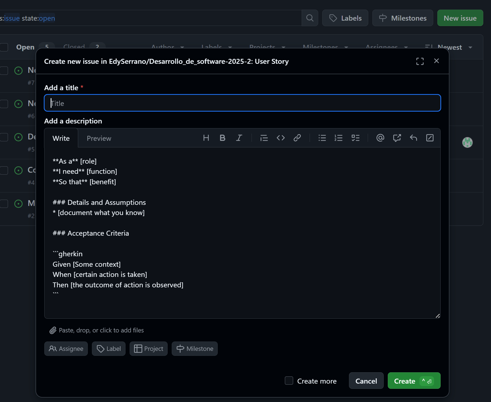

* **Límite:** New Issues con límite 7.

    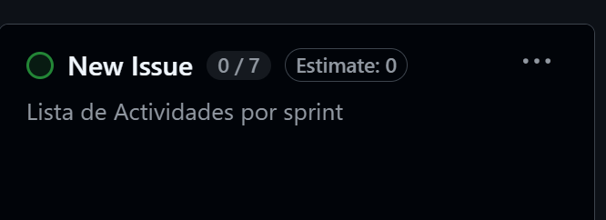

* **Priorización:** Counter al inicio de Product Backlog, Multiple Counters en Icebox, resto en New Issues.

    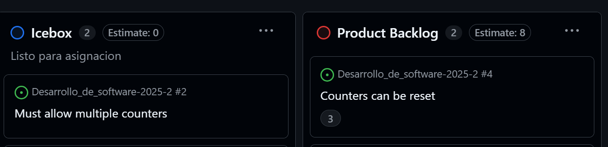

## Parte 4: Refinamiento y labels

* **Triage:**

    * **Deploy bajo Persist:**

        

    * **Remove a Icebox:**

        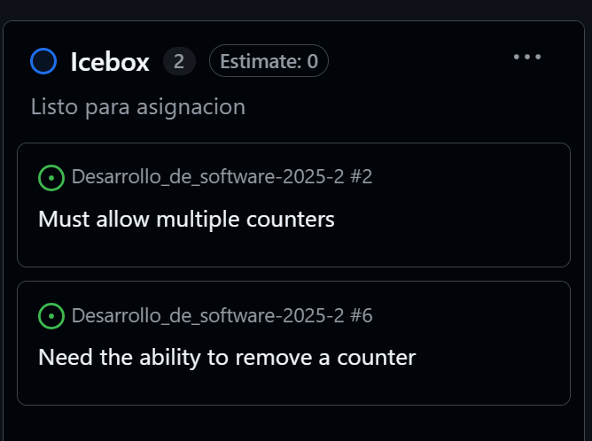

    * **Update tras Reset:**

        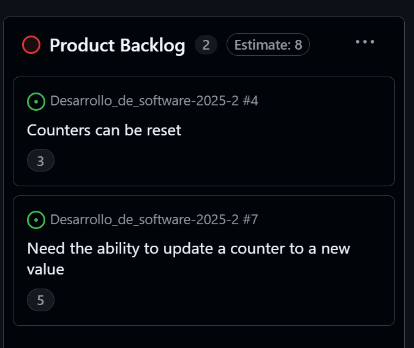

* **Edición:** Detalles y criterios para todas las historias en Product Backlog.

    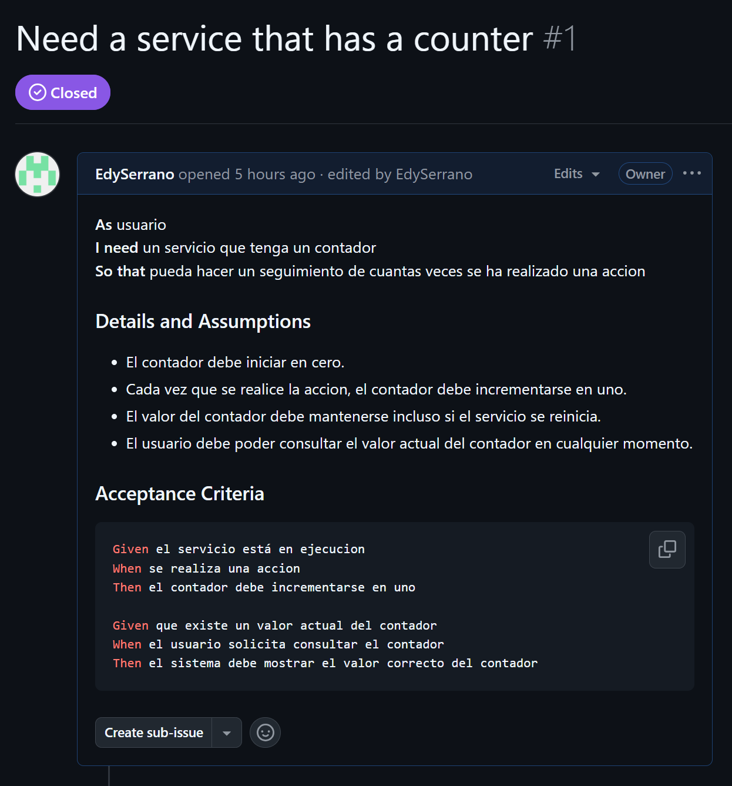

* **Label Technical Debt:** Amarillo #FBCA04.

    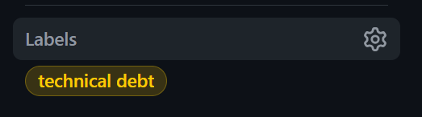

* **Labels Asignados:** enhancement para la mayoría, technical debt para Deploy.

    

## Ejercicios
### Ejercicio 1: Epic

* **Enlace:** [Epic: Implementar servicio de contador](https://github.com/EdySerrano/Desarrollo_de_software-2025-2/issues/10)

    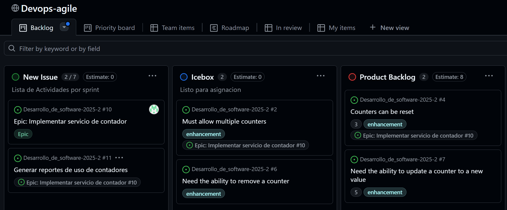

### Ejercicio 2: Etiquetas
* **Labels:** High/Medium/Low Priority, In Review, Blocked, Ready for Testing.

    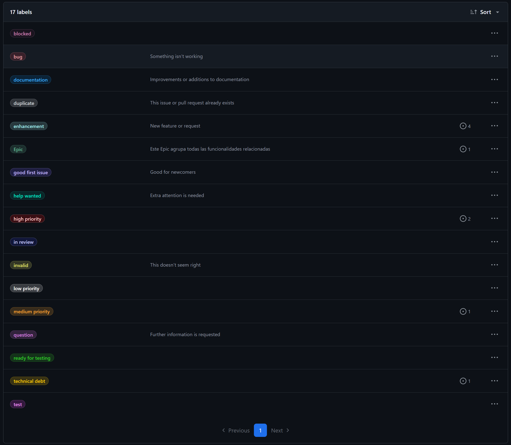

* **Tablero:**

    

### Ejercicio 3: GitHub Actions
* **Enlace:** [.github/workflows/kanban-automation.yml](https://github.com/EdySerrano/Desarrollo_de_software-2025-2/blob/main/.github/workflows/project-automation.yml)
* **Evidencia:**
    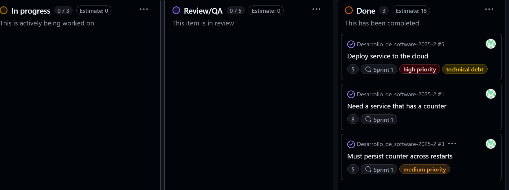

* **Archivo de automatizacion:**
    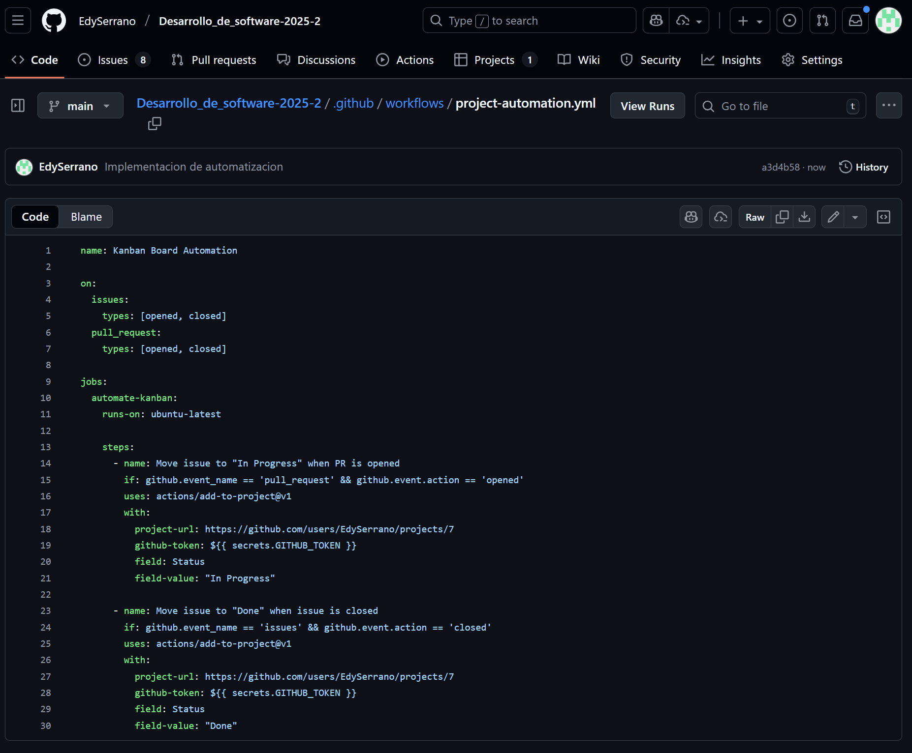

### Ejercicio 4: Tiempo
* Esfuerzo estimado en (horas)
    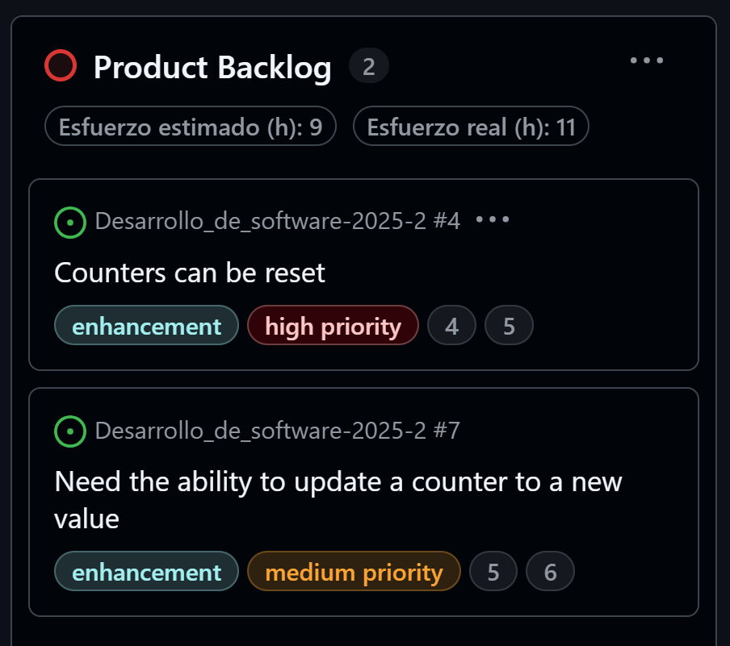

### Ejercicio 5: Stakeholder Feedback
* **Enlace:** [Exportar a CSV](https://github.com/users/EdySerrano/projects/7/views/1?pane=issue&itemId=134828550&issue=EdySerrano%7CDesarrollo_de_software-2025-2%7C12)

* Historia priorizada
    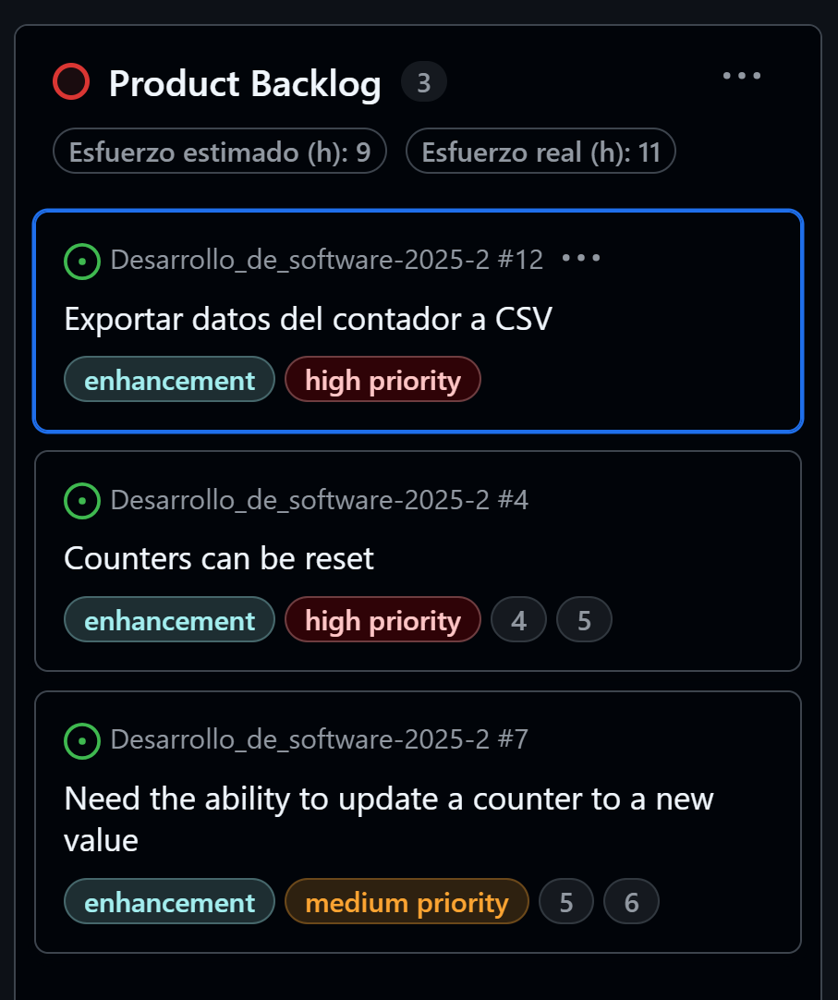

### Ejercicio 6: Análisis

* **Métricas:** Cycle time, cuellos de botella (Review/QA: 3 días).

    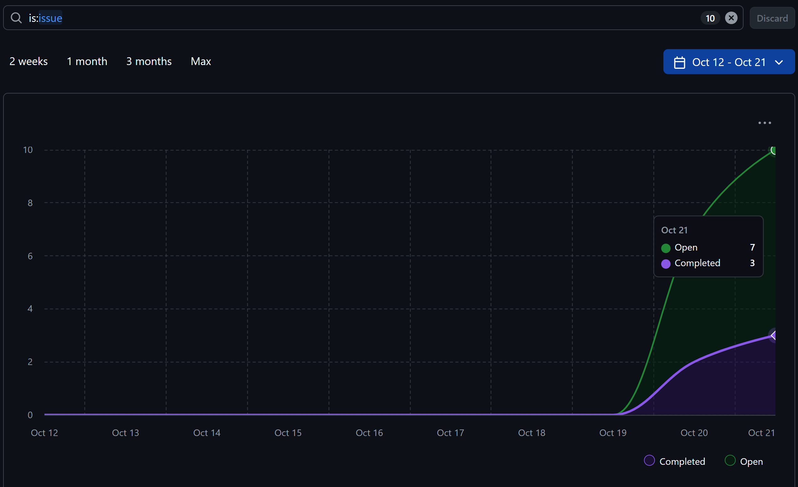

* **Reporte:**

    [reporte-metricas.txt](capturas/reporte-metricas.txt)