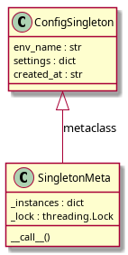
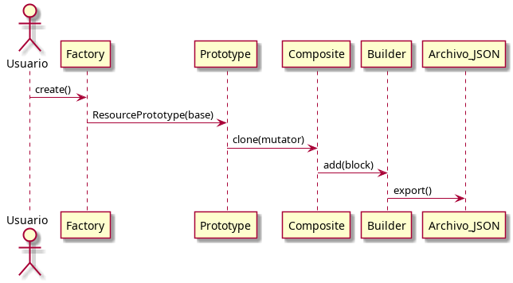

# Entregable Fase 1: Exploración y análisis de patrones IaC

## 1. Singleton
- `SingletonMeta` garantiza una sola instancia usando el diccionario `_instances`, donde la clave es la clase y el valor es la instancia única creada.
- El método `__call__` se encarga de crear la instancia solo si no existe previamente.
- El `lock` (`_lock`) asegura que en entornos multihilo no se creen instancias duplicadas por condiciones de carrera, sincronizando el acceso a la creación de instancias.

## 2. Factory
- La clase `NullResourceFactory` encapsula la creación de recursos Terraform tipo `null_resource`.
- El método `create` genera un diccionario compatible con Terraform.
- Los `triggers` permiten forzar la recreación del recurso en Terraform, usando UUID y timestamp para unicidad y trazabilidad.

## 3. Prototype
- El patrón Prototype permite clonar un recurso base (`template`) usando `deepcopy`, asegurando independencia entre instancias.
- El parámetro `mutator` es una función que personaliza el clon, permitiendo variaciones sin modificar el original.

## 4. Composite
- `CompositeModule` permite agrupar múltiples bloques de recursos en una sola estructura JSON válida para Terraform.
- El método `add` agrega bloques hijos y `export` fusiona recursivamente los recursos.

## 5. Builder
- `InfrastructureBuilder` orquesta los patrones: usa Factory para crear el recurso base, Prototype para clonar y mutar, Composite para agrupar y finalmente exporta a JSON.

## 6. Diagramas UML

A continuación se muestran los diagramas generados con PlantUML:

### Diagrama de clases Singleton

### Diagrama de flujo Factory → Prototype → Composite → Builder

### Diagrama de clonación en Prototype

