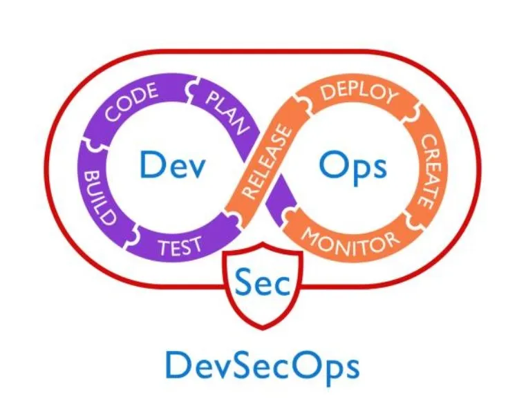
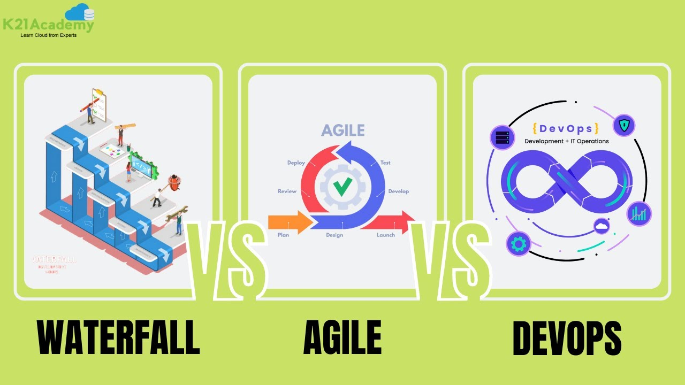
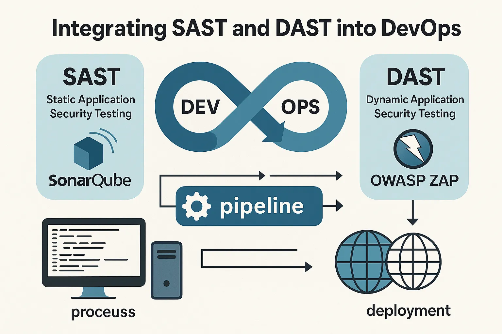

# Actividad 1: introducción devops, devsecops

**Hinojosa Zamora Frank Oliver**

**Fecha : 31/08/25**

## 4.1 DevOps vs. cascada tradicional (investigación + comparación)

### Imagen comparativa

| Característica | Waterfall (Cascada) | Agile (Ágil) | DevOps |
| :--- | :--- | :--- | :--- |
| **Enfoque** | Lineal y secuencial. Cada fase depende de la anterior. | Iterativo e incremental. Se entrega valor en ciclos cortos. | Cultural y de prácticas. Integra desarrollo y operaciones. |
| **Filosofía** | Planificación detallada y completa antes de iniciar. | Adaptabilidad al cambio y colaboración continua. | Automatización, colaboración y entrega continua. |
| **Rol del Cliente** | Participación limitada al inicio del proyecto. | Participación continua y activa durante todo el proceso. | Retroalimentación en la automatización y mejora continua. |
| **Entrega de Valor** | Se entrega el producto completo al final del proyecto. | Entregas funcionales y parciales de forma frecuente. | Despliegues frecuentes y automatizados de software. |
| **Adaptabilidad al Cambio** | Muy difícil y costoso. | Alta. Los cambios son bienvenidos en cualquier momento. | Muy alta. Permite reaccionar rápidamente a problemas. |
| **Comunicación** | Poca comunicación entre equipos, trabajan en silos. | Colaboración constante y cara a cara. | Integración y comunicación fluida entre equipos. |
| **Prácticas Comunes** | Requisitos detallados, planificación a largo plazo. | Sprints, reuniones diarias (Daily Stand-ups), retrospectivas. | CI/CD (Integración y Entrega Continua), automatización de pruebas, monitoreo. |
| **Ideal para** | Proyectos con requisitos estables y bien definidos. | Proyectos complejos con requisitos cambiantes. | Optimizar la entrega de software de alta calidad y velocidad. |

### ¿ Por qué DevOps acelera y reduce riesgo en software para la nube frente a cascada (feedback continuo, pequeños lotes, automatización) ?

En la metodologia cascada al usar un metodo secuencial (**cada fase depende de la anterior**) se construyen grandes lotes de cambios. Por lo que si en producción se descubre un error, el costo de volver atras es enorme, tendriamos que reabrir la cadena completa. Mientras que en DevOps, los lotes son pequeños y frecuentes, se automatizan pruebas y despliegues, y se recibe feedback inmediato reduciendo riesgo porque **los errores se detectan en minutos/horas y no en meses**.

### Pregunta retadora

**Software Aeroespacial y Aviación**, Los proyectos aeroespaciales, como el diseño de un sistema de control de vuelo, siguen el modelo en cascada para cumplir con estrictos requisitos de seguridad. Cada etapa (diseño, simulación, fabricación y certificación) se ejecuta en una secuencia fija, con una rigurosa supervisión en cada paso. 

Este proceso estructurado garantiza el cumplimiento, minimiza el riesgo y ofrece sistemas confiables que cumplen con los estándares industriales y regulatorios.

- **Criterio 1 verificable**: normativas (DO-178C, FDA, ISO 26262) exigen procesos formales con auditorías y entregables aprobados, por lo que no es aceptable *fallar rápido* en producción.

- **Criterio 2 verificable**: pruebas ligadas a hardware (simuladores, prototipos) cuestan decenas de miles de dólares y *no es viable iterar cada día*.

## 4.2 Ciclo tradicional de dos pasos y silos (limitaciones y anti-patrones)

**Limitaciones**

- *Grandes lotes de defectos*, sin una integración continua los errores se acumulan hasta la fase de pruebas/operación. Esto multiplica el costo de corregirlos (Ley de Boehm: corregir un error en producción cuesta 100x más que en desarrollo).

- *Colas de integración*, cuando los equipos trabajan en silos, juntar el código se vuelve muy caotico.

**Anti-patrones**

1. *Throw over the wall*, los devs lanzan el binario al equipo de ops, sin documentación. Lo que provoca que ops no entiende las dependencias y cuando algo falla, MTTR (Mean Time To Recovery) sube drásticamente.

2. *Seguridad como auditoría tardía*, revisiones de seguridad al final del ciclo generar:
    - *Costo de integración tardía*, vulnerabilidades detectadas en producción que requieren rollbacks costosos.
   - *Asimetrías de información*, los equipos de seguridad desconocen decisiones de arquitectura tomadas meses atrás.

## 4.3 Principios y beneficios de DevOps (CI/CD, automatización, colaboración; Agile como precursor)

**CI/CD**

1. **Integracion Continua (CI)**, proceso de automatizacion que facilita la fusion mas frecuentes de cambios de codigo en una rama compartida o *troncal*. A medida que se realizan estas actualizaciones, se activan pruebas automatizadas garantizando la fiabilidad de los cambios fusionados.

2. **Entrega/Despliegue Continuo**

    - *Entrega continua*, **automatiza la publicación de código validado en un repositorio tras la automatización de compilaciones y pruebas unitarias y de integración en CI**. Cada etapa, desde la integración de los cambios de código hasta la entrega de compilaciones listas para producción, implica la automatización de pruebas y la automatización de la publicación de código. Al final de este proceso, el equipo de operaciones puede implementar rápidamente una aplicación en producción.

    - *Despliegue continuo*, la etapa final de un pipeline de CI/CD maduro es el despliegue continuo. Es una extensión de la entrega continua y puede referirse a la **automatización de la liberación de los cambios de un desarrollador desde el repositorio a producción**, donde los clientes pueden usarlos.

### Práctica Agil que alimenta decisiones del pipeline

1. **Reuniones Diarias (Daily Stand-ups)**, encuentros breves y de pie donde el equipo sincroniza su trabajo y discute el progreso.
    - *Toma de decisiones en tiempo real*, los desarrolladores pueden identificar rápidamente problemas que están bloqueando su trabajo, como fallos en las pruebas de integración o dependencias rotas

    - *Priorización de tareas*, si se descubre un error crítico en el código que ya está en el pipeline, el equipo puede decidir que la prioridad es detener el avance de ese código y, en su lugar, crear un arreglo de alta prioridad (un "hotfix") para ser promovido primero

2. **Retrospectivas**, reuniones que se celebran al final de un sprint (ciclo de trabajo)
    - *Optimización del pipeline*, el equipo puede analizar por qué el pipeline de CI/CD se está demorando o por qué una prueba automatizada en particular falla con frecuencia.
    - *Prevención de problemas futuros*, si los errores en producción fueron un problema recurrente durante el sprint, la retrospectiva ayudará a identificar la causa raíz.

**Indicador observable para medir colaboración Dev-Ops**

- *Tiempo desde PR listo hasta despliegue en entorno de pruebas*, mide un punto específico del ciclo de vida del software donde la colaboración es crucial: el momento en que un cambio de código está validado por el desarrollador y listo para ser probado por el resto del equipo.

## 4.4 Evolución a DevSecOps (seguridad desde el inicio: SAST/DAST; cambio cultural)

### Gates de Seguridad en DevSecOps
**¿Qué son?**,un gate de seguridad es un punto de control automatizado en el pipeline que decide si una build puede o no promoverse al siguiente entorno (staging, producción). Sirve para detener software inseguro antes de que llegue a los usuarios.

**Tipos de Gates de Seguridad**

- SAST (estático, temprano)
- DAST (dinámico, en ejecución)
- Dependencias
- Infraestructura / Configuración

### Integracion de SAST y DAST en DevOps

1. **Pruebas de seguridad de aplicaciones estáticas (SAST)**, analiza tu código fuente o el código binario de una aplicación sin ejecutarlo. Buscando vulnerabilidades de seguridad conocidas, como inyecciones SQL o desbordamientos de búfer, directamente en el código. Por qué es importante:

    - Detectar vulnerabilidades de forma temprana
    - Dar retroalimentación directamente a los desarrolladores
    - Hacer cumplir el cumplimiento (como OWASP Top 10, CWE, SANS Top 25)
    - Además, es mucho más barato corregir una vulnerabilidad durante la programación que después de la implementación. 

2. **Pruebas dinámicas de seguridad de aplicaciones (DAST)**, es una prueba de *caja negra*: no le importa tu código fuente. En cambio, examina tu aplicación en ejecución, tal como lo haría un atacante externo. Por qué es importante:

    - Encuentra debilidades en el mundo real
    - Funciona en cualquier pila tecnológica
    - Detecta lo que el análisis estático no puede , como autenticación rota, sesiones defectuosas o servidores mal configurados.

**¿Por qué integrar la seguridad directamente en DevOps?**, no queremos que la seguridad fuera lo que ralentize todo sino que formara parte del flujo. Y de eso se trata DevSecOps. Al incorporarlo a nuestras piplines, podemos:

- Detectar errores antes de que lleguen a producción.
- Acortar el tiempo necesario para solucionar problemas críticos.
- Evite las “carreras de último momento” antes de un lanzamiento.

### Gate mínimo de seguridad con dos umbrales cuantitativo

Un gate no es *pasa/no pasa* arbitrario, sino criterios cuantitativos y verificables.

**Umbrales cuantitativos:**
1. **Vulnerabilidades críticas SAST**: 0 hallazgos con CVSS ≥7.0 en componentes expuestos
2. **Cobertura DAST**: ≥80% de endpoints críticos probados (autenticación, pagos, API públicas)

**Política de excepción:**
- **Responsable**: Tech Lead del equipo
- **Caducidad**: 7 días calendario
- **Plan de corrección**: Aplicar parche o mitigación (WAF) con nueva evaluación DAST

## 4.5 CI/CD y estrategias de despliegue (sandbox, canary, azul/verde)

### Despliegue Canario

### Estrategia elegida: Canary para microservicio de autenticación

**Justificación**: El servicio de autenticación es crítico pero tolera experimentación controlada. Canary permite validación gradual minimizando impacto en usuarios.

### Tabla de riesgos vs mitigaciones

| Riesgo | Mitigación |
|--------|------------|
| Regresión funcional en autenticación | Validación de contratos de API antes de promover tráfico |
| Costo operativo del doble despliegue | Límite de tiempo de convivencia: máximo 2 horas |
| Sesiones existentes incompatibles | Draining gradual y compatibilidad de esquemas de tokens |

### KPI y umbrales para promoción/rollback

**KPI primario**: Tasa de errores HTTP 5xx
- **Umbral**: ≤0.1% en ventana de observación de 1 hora
- **Promoción**: Si canary mantiene ≤0.1% durante 1 hora, promover a 100%
- **Rollback**: Si canary supera 0.1% en cualquier momento, revertir inmediatamente

### Coexistencia de métricas técnicas y de producto

Si el KPI técnico se mantiene pero cae la conversión (ej: logins exitosos -15%), ambas métricas deben coexistir porque:
- **Métricas técnicas**: Detectan problemas de infraestructura y estabilidad
- **Métricas de producto**: Revelan problemas de UX, funcionalidad o experiencia del usuario

