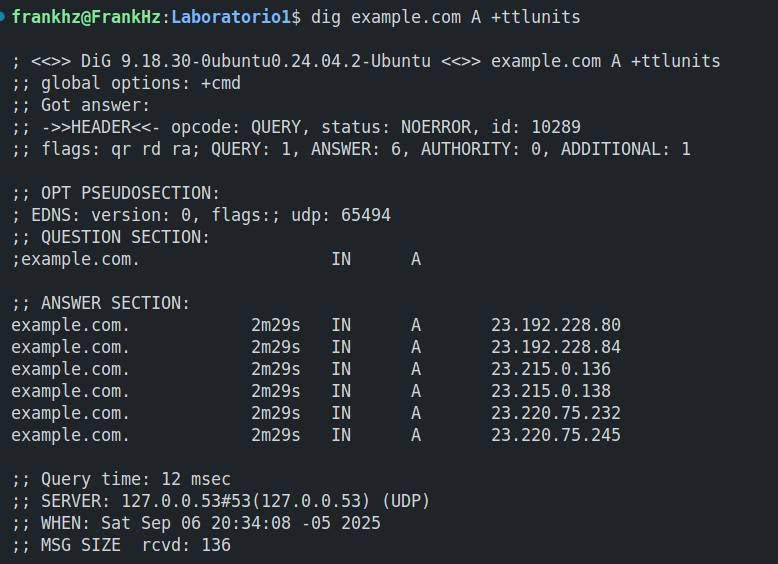

# Actividad 2:  HTTP, DNS, TLS y 12-Factor (port binding, configuración, logs)

## 1) HTTP: Fundamentos y herramientas

1. **Levanta la app** con variables de entorno (12-Factor):
   `PORT=8080 MESSAGE="Hola CC3S2" RELEASE="v1" python3 app.py` (usa tu *venv*). 

    **Creamos el entorno virtual:**
    ```bash
    python3 -m venv venv
    source venv/bin/activate
    ```

    **Ya dentro del entorno instalamos `flask`**
    ```bash
    pip install flask
    ```

    **Levantamos la aplicacion**
    ```bash
    PORT=8080 MESSAGE="HOLA CC3S2" RELEASE="v1" python3 app.py 
    ```
    
    

    **Comprobamos**
        
    <div style="text-align: center;">
    
    </div>


2. **Inspección con `curl`:**

    `curl -v http://127.0.0.1:8080/` (cabeceras, código de estado, cuerpo JSON).

    

    `curl -i -X POST http://127.0.0.1:8080/` 
   
   

    En la aplicación Flask solo se define la ruta `/` con el decorador `@app.route("/")` que por defecto solo acepta métodos GET y HEAD. Cuando intentamos hacer POST a la misma ruta, Flask responde con 405 Method Not Allowed.

    Por otro lado el header Allow nos indica que métodos si están permitidos para esa ruta:

    - OPTIONS: método estándar para consultar qué métodos acepta el endpoint
    - HEAD: versión sin cuerpo del GET (solo headers)
    - GET: el método que realmente implementaste en el código

   **Pregunta guía:** ¿Qué campos de respuesta cambian si actualizas `MESSAGE`/`RELEASE` sin reiniciar el proceso? 

    Ningun campo cambiaria en la respuesta JSON, esto debido a que las variables de entorno se leen una sola vez cuando el proceso inicia y se ejecutan estas líneas por lo que los valores MESSAGE y RELEASE quedan fijos en memoria durante toda la vida del proceso. Asi que si intenamos cambiar variables de entorno en la shell esto no afectara al proceso ya en ejecución, **solo afecta nuevos procesos que se lancen**.

    En el contexto **12-Factor**, este comportamiento es consistente con el principio de configuración por entorno, en donde la configuración se lee al inicio del proceso y para cambiar la configuración necesitamos reiniciar el proceso lo que garantiza comportamiento predecible y evita cambios inesperados durante ejecución

3. **Puertos abiertos con `ss`:**

   * `ss -ltnp | grep :8080` (evidencia del proceso y socket).

    

    | Comando | Descripción |
    |---|---|
    | -l | Muestra solo los sockets que están en estado de escucha (_listening_). |
    | -t | Muestra solo las conexiones de tipo TCP. |
    | -n | Muestra las direcciones numéricas en lugar de resolver los nombres de _hosts_, lo que acelera la ejecución. |
    | -p | Muestra el identificador del proceso (_PID_) y el nombre del programa al que pertenece el _socket_. |

4. **Logs como flujo:** Demuestra que los logs salen por stdout (pega 2–3 líneas). Explica por qué **no** se escriben en archivo (12-Factor).

    

    ¿Por que **no** se escriben en archivo (12-Factor)?

    Por el principio de **Logs = Flujos de eventos**

    - Separación de responsabilidades: La aplicación NO debe preocuparse por gestionar archivos de log. Su responsabilidad es generar eventos

    - Flexibilidad de destino: Al escribir a stdout, el entorno de ejecución decide qué hacer con los logs

    - Simplicidad: La app no necesita configurar rutas, rotación, permisos de archivos


## 2) DNS: nombres, registros y caché

**Meta:** resolver `miapp.local` y observar TTL/caché.

1. **Hosts local:** agrega `127.0.0.1 miapp.local` (Linux y/o Windows según tu entorno).

    

2. **Comprueba resolución:**

   `dig +short miapp.local` (debe devolver `127.0.0.1`).

    

   `getent hosts miapp.local` (muestra la base de resolución del sistema).

    

3. **TTL/caché (conceptual):** con `dig example.com A +ttlunits` explica cómo el TTL afecta respuestas repetidas (no cambies DNS público, solo observa).

    El **TTL** (Time To Live) es un valor en segundos que indica cuánto tiempo puede un resolver DNS mantener una respuesta en caché antes de considerarla expirada.

    <div style="display: flex; justify-content: center; gap: 10px;">
        
        
    </div>

    El resolver local (127.0.0.53) cachea la respuesta y va decrementando el TTL cada segundo. Las consultas subsecuentes se sirven desde caché sin necesidad de consultar servidores externos.Las respuestas cacheadas son instantáneas (0 ms) vs consultas externas que toman decenas de milisegundos, para cuando el TTL llegue a 0, el próximo dig forzará una nueva consulta al servidor autoritativo, reiniciando el TTL al valor original.

4. **Pregunta guía:** ¿Qué diferencia hay entre **/etc/hosts** y una zona DNS autoritativa? ¿Por qué el *hosts* sirve para laboratorio?

   | Aspecto | /etc/hosts | Zona DNS Autoritativa |
   |---------|------------|---------------------|
   | **Ámbito** | Solo local (una máquina) | Global (Internet) |
   | **Precedencia** | Primera consulta (prioridad alta) | Segunda consulta |
   | **Gestión** | Manual, archivo texto | Centralizada, servidores DNS |
   | **Escalabilidad** | No escalable (máquina por máquina) | Altamente escalable |
   | **Propagación** | Instantánea | Controlada por TTL |
   | **Disponibilidad** | Depende del archivo local | Alta disponibilidad/redundancia |
   | **Uso típico** | Desarrollo/testing | Producción |

   **¿Por qué /etc/hosts sirve para laboratorio?**
   - Simplicidad: no requiere configurar servidores DNS
   - Control total: cambios inmediatos sin esperar propagación
   - Aislamiento: solo afecta el entorno de desarrollo  
   - Perfecto para `miapp.local → 127.0.0.1` en testing local

## 3) TLS: seguridad en tránsito con Nginx como *reverse proxy*

**Meta:** terminar TLS en Nginx `:443` y *proxyear* a Flask en `127.0.0.1:8080`.

1. **Certificado de laboratorio:** genera autofirmado (usa el *target* `make tls-cert` si existe) y coloca crt/key donde lo espera Nginx (ver guía).

    ```bash
    make tls-cert
    ```

    <div style="text-align: center;">
    
    </div>

    Generacion de los certificados `.crt` y `.key`

    <div style="text-align: center;">
    
    </div>

2. **Configura Nginx:** usa el ejemplo provisto para **terminación TLS** y **proxy\_pass** a `http://127.0.0.1:8080;` con cabeceras `X-Forwarded-*`. Luego `nginx -t` y **reinicia** el servicio.
   Incluye el *snippet* clave de tu `server` en el reporte.

    *Configuramos Ngnix*
    ```bash
    make nginx
    ```
    <div style="text-align: center;">
    
    </div>

    1. Los certificados se copian a miapp
    <div style="text-align: center;">
    
    </div>

    2. Se instala la configuración de Nginx (miapp.conf)
    3. Nginx se configura como reverse proxy

    *Abrimos el puerto*
    ```bash
    sudo ufw allow 443/tcp
    ```
    <div style="text-align: center;">
    
    </div>

    **Flujo de una petición:**

    1. Cliente hace petición HTTPS a https://miapp.local:443
    2. Nginx recibe la conexión en puerto 443:
        - Maneja el handshake TLS usando los certificados
        - Descifra la petición HTTPS
    3. Nginx reenvía la petición como HTTP simple a 127.0.0.1:8080
    4. Flask recibe la petición HTTP en puerto 8080:
        - Procesa la petición
        - Responde con HTTP
    5. Nginx recibe la respuesta HTTP de Flask:
        - La cifra con TLS
        - La envía de vuelta al cliente como HTTPS

3. **Valida el *handshake*:**

    `openssl s_client -connect miapp.local:443 -servername miapp.local -brief` (muestra TLSv1.2/1.3, cadena, SNI).

    ```bash
    openssl s_client -connect miapp.local:443 -servername miapp.local -brief
    ```
    Establece una conexión TLS directa y muestra información detallada del handshake

    <div style="text-align: center;">
    
    </div>

   `curl -k https://miapp.local/` (explica el uso de `-k` con certificados autofirmados).

    ```bash
    curl -k https://miapp.local/
    ```
    
    Hace una petición HTTPS completa a la aplicación
    - `-k` o `--insecure`: Ignora errores de verificación de certificados SSL

    <div style="text-align: center;">
    
    </div>

    **¿Por qué usar -k con certificados autofirmados?**, los certificados autofirmados **NO** están firmados por una Autoridad Certificadora (CA) reconocida. Sin -k, curl fallara

    <div style="text-align: center;">
    
    </div>

    **Diferencia entre `openssl s_client` y `curl -k`**

    | Aspecto      | openssl s_client            | curl -k                         |
    |--------------|-----------------------------|---------------------------------|
    | Propósito    | Verificar handshake TLS      | Petición HTTP completa           |
    | Información  | Detalles de cifrado/certificado | Respuesta de aplicación      |
    | Nivel        | Protocolo TLS                | Protocolo HTTP sobre TLS         |
    | Uso          | Diagnóstico de conexión      | Validación end-to-end            |


5. **Puertos y logs:**

   `ss -ltnp | grep -E ':(443|8080)'` (evidencia de ambos sockets).

    ```bash
    ss -ltnp | grep -E ':(443|8080)'
    ```

    Verifica que tanto Nginx como Flask están escuchando en sus puertos respectivos

    <div style="text-align: center;">
    
    </div>

    - **Valida la arquitectura :** Nginx publico (443) + Flask interno (8080)
    - **Seguridad :** Flask no esta expuesto externamente
    - **Diagnostico :** Si algun puerto no aparece, sabremos que servicio tiene problemas

    `journalctl -u nginx -n 50 --no-pager` **o** `tail -n 50 /var/log/nginx/error.log` (pega 3–5 líneas relevantes).

    ```bash
    journalctl -u nginx --no-pager -n 100
    ```

    Nos muestra los logs específicos del servicio nginxs

    <div style="text-align: center;">
    
    </div>

    ```bash
    tail -n 50 /var/log/nginx/error.log
    ```

    Nos muestra las ultimas líneas de un archivo, en este caso `-n 50` que especifica mostrar las últimas 50 líneas de la ruta del archivo de logs de errores de Nginx

    Tipos de logs de Ngnix
    - Error Log
    - Access Log

    <div style="text-align: center;">
    
    </div>


> Nota: el *vínculo*  Nginx->Flask es **HTTP interno** en `127.0.0.1:8080`, tu cliente entra por **HTTPS** en `:443`.

## 4) 12-Factor App: port binding, configuración y logs

**Meta:** demostrar tres principios clave en tu app.

1. **Port binding:** muestra que la app **escucha** en el puerto indicado por `PORT` (evidencia `ss`).

    ```bash
    ss -ltnp | grep :8080
    ```

    <div style="text-align: center;">
    
    </div>

    La aplicacion está correctamente enlazada (bind) al puerto 8080. El proceso Python (PID 37065) está escuchando exclusivamente en localhost:8080, lo que demuestra el principio de port binding de 12-Factor.

2. **Config por entorno:** ejecuta dos veces con distintos `MESSAGE`/`RELEASE` y documenta el efecto en la respuesta JSON.

    **Primera ejecución**
    ```bash
    PORT=8080 MESSAGE="CC" RELEASE="v1" python3 app.py
    ```

    <div style="text-align: center;">
    
    </div>

    **Segunda ejecución**
    ```bash
    PORT=8080 MESSAGE="Desarrollo Software" RELEASE="v2025-2" python3 app.py
    ```

    <div style="text-align: center;">
    
    </div>


    Los campos `message` y `release` cambian dinamicamente segun las variables de entorno sin necesidad de modificar el codigo fuente lo que demuestra el principio de configuracion por entorno de 12-Factor, donde la configuracion se **separa** completamente del código.

3. **Logs a stdout:** redirige a archivo mediante *pipeline* de shell y adjunta 5 líneas representativas. Explica por qué **no** se configura *log file* en la app.

    **Rediriguiendo los logs de la aplicacion a un archivo usando pipeline de shell**
    ```bash
    PORT=8080 MESSAGE="Logs" RELEASE="v1" python3 app.py 2>&1 | tee app_logs.txt
    ```

    <div style="text-align: center;">
    
    </div>

    **Lineas representativas de logs capturadas por el archivo app_log.txt**
    
    <div style="text-align: center;">
    
    </div>

    **Razones fundamentales del principio 12-Factor por la cual no debemos configurar log file en la app**

    - **Separación de responsabilidades,** la aplicacion se enfoca en **generar logs**, **no en gestionarlos**. El sistema operativo o herramientas externas se encargan del almacenamiento.

    - **Flexibilidad de despliegue,** en contenedores Docker, los logs van a stdout/stderr y pueden ser redirigidos a diferentes destinos (archivos, sistemas centralizados, etc.) sin cambiar la aplicación.

## 5) Operación reproducible (Make/WSL/Linux)

**Meta:** empaquetar tu flujo en `make` o scripts para repetirlo en otra máquina.

* Sigue la guía paso a paso (Linux/WSL) y **documenta divergencias** (p.ej. `systemctl` vs `service` en WSL, *hosts* de Windows vs WSL).
  Incluye una tabla "Comando -> Resultado esperado".
* Si tienes *targets* como `make prepare`, `make run`, `make nginx`, `make check-http`, `make check-tls`, `make dns-demo`, úsalos y pega su salida resumida.

#### Mejora incremental 

* **Logs estructurados** (JSON por línea) en stdout. Muestra un ejemplo y por qué facilita *parsing*.
* **Script `make`** que haga *end-to-end*: preparar venv -> levantar app -> cert TLS -> Nginx -> chequeos `curl/dig/ss`.;
* **`systemd`** (si aplica): define unidad para la app y valida con `systemctl status` y `journalctl -u`. (Adjunta *snippet* clave y evidencia).

**Tabla de Comandos Make → Resultado Esperado**

| **Comando** | **Resultado Esperado** | **Descripción** |
|-------------|------------------------|-----------------|
| `make help` | Lista de targets disponibles con descripciones | Muestra todos los comandos make disponibles |
| `make debug-venv` | Variables de entorno y rutas del venv detectadas | Diagnóstico de configuración del entorno virtual |
| `make prepare` | Venv 'bdd' creado e instalación de Flask | Crea entorno virtual y instala dependencias |
| `make hosts-setup` | `127.0.0.1 miapp.local` agregado a hosts | Configura resolución DNS local |
| `make run` | App Flask ejecutándose en `http://127.0.0.1:8080` | Inicia la aplicación en primer plano |
| `make check-http` | Respuesta JSON + evidencia de socket en puerto 8080 | Verifica que la app HTTP esté funcionando |
| `make tls-cert` | Certificados creados en directorio certs | Genera certificados SSL autofirmados |
| `make nginx` | Nginx configurado y recargado + mensaje de éxito | Instala configuración de reverse proxy TLS |
| `make ufw-open` | Puertos 80/443 abiertos en firewall | Abre puertos necesarios para HTTPS |
| `make check-tls` | Handshake TLS exitoso + respuesta HTTPS | Valida conexión SSL y proxy reverso |
| `make dns-demo` | Consultas DNS variadas con TTL visible | Demuestra tipos de registros DNS |
| `make systemd-install` | Servicio systemd habilitado y ejecutándose | Instala la app como servicio del sistema |
| `make cleanup` | Servicios detenidos, configuraciones removidas | Limpia la instalación conservando certificados |


**Comandos de Diagnóstico**
| **Comando Manual** | **Resultado Esperado** |
|-------------------|------------------------|
| `ss -ltnp \| grep -E ':(443\|8080)'` | Nginx en 443 + Flask en 8080 |
| `curl -k https://miapp.local/` | Respuesta JSON via HTTPS |
| `dig +short miapp.local` | `127.0.0.1` |
| `getent hosts miapp.local` | `127.0.0.1 miapp.local` |


**Preguntas guía (responde en `Reporte.md`)**

1. **HTTP:** explica **idempotencia** de métodos y su impacto en *retries*/*health checks*. Da un ejemplo con `curl -X PUT` vs `POST`.

    Un método HTTP se considera idempotente si ejecutarlo múltiples veces con los mismos parámetros produce el mismo resultado que ejecutarlo una sola vez.

    - Métodos idempotentes
        * `GET`: Obteniene datos sin modificar el estado
        * `PUT`: Crea/actualiza un recurso con el mismo resultado
        * `DELETE`: Elimina (si ya está eliminado, no cambia nada)
    - Métodos **NO** idempotentes
        * `POST`: Se usa para crear un nuevo recurso. Cada vez que envías la misma solicitud POST, el servidor creará un nuevo recurso lo que puede resultar en duplicados no deseados.

2. **DNS:** ¿por qué `hosts` es útil para laboratorio pero no para producción? ¿Cómo influye el **TTL** en latencia y uso de caché?;

    Es util para laboratorio porque nos da **control total, simplicidad, ailamiento, rapidez**. Mientras que en produccion no sirve debido a que **no escala, la gestion es manual, sin distribuccion.**

    El TTL determina la duración del caché, tenemos :
    - **TTL alto**, promueve un uso intensivo de la caché. Con un TTL alto, no necesita volver a consultar al servidor DNS autoritativo durante mucho tiempo.
    - **TTL bajo**, limita el uso de la caché. El registro expira rápidamente, lo que obliga a los clientes a obtener la información más reciente. Esto es ideal para servicios que requieren cambios frecuentes o una alta disponibilidad.

3. **TLS:** ¿qué rol cumple **SNI** en el *handshake* y cómo lo demostraste con `openssl s_client`?

    El SNI (Indicación del Nombre del Servidor) es una extensión de TLS que permite a un cliente especificar el nombre del host al que desea conectarse durante el handshake, permite que un solo servidor con una única dirección IP aloje múltiples sitios web seguros.


4. **12-Factor:** ¿por qué **logs a stdout** y **config por entorno** simplifican contenedores y CI/CD?;

    - **Logs a stdout**, simplifica los contenedores al usar stdout, la aplicacion se vuelve "agnóstica" al sistema de logs, ya que el contenedor se encarga de todo lo demás: capturar, almacenar y reenviar los logs a un sistema centralizado

    - **Configuración por entorno**, simplifica `CI/CD` pues permite que un solo artefacto de construcción como una imagen `Docker` se pueda desplegar en múltiples entornos (desarrollo, pruebas, producción) sin cambios en el código.

5. **Operación:** ¿qué muestra `ss -ltnp` que no ves con `curl`? ¿Cómo triangulas problemas con `journalctl`/logs de Nginx?;

    El comando `ss -ltnp` muestra los sockets activos en el sistema operativo, revelando que proceso está escuchando en qué puerto y su estado (LISTEN). Esta información a nivel de sistema no es visible con curl, que es solo una herramienta de cliente que intenta conectarse a una URL.
