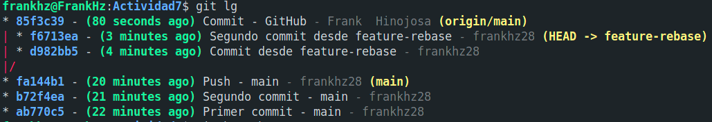

# Actividad 7

### 1) Fusión Fast-forward (`git merge --ff`)

Ocurre cuando la rama destino puede ser **avanzada** directamente hasta el commit de la rama que queremos fusionar, sin necesidad de crear un commit de merge.

- **Ventajas del fast-forward**

    1. Historial limpio y lineal.

    2. Fácil de leer y seguir.

    3. No introduce commits innecesarios.

- **Desventajas del fast-forward**

    1. Se **pierde** la referencia de que alguna vez existió una rama separada.(Para proyectos grandes, a veces sí queremos ver esos puntos de unión).


### 2) No-fast-forward (`git merge --no-ff`)

Forzamos a Git a crear un commit de fusión, incluso si podría haber hecho un fast-forward. Solemos usarlo para una mejor trazabilidad y un contexto de trabajo

- **Ventajas del Squash**

    1. Historial más explícito y con más semántica.

    2. Facilita revisar el código en pull requests (porque se ve el bloque de cambios asociado a la rama).

    3. Da soporte natural a flujos de trabajo como Git Flow o GitHub Flow.

- **Desventajas del Squash**

    1. El historial puede volverse más ramificado y "ruidoso".
    2. Si se abusa, puede generar commits de merge innecesarios, complicando la lectura.

    **Usar buenas practicas**
    1. Squash merges
    2. Pull requests bien estructurados
    3. Rebase antes del merge, en caso de querer limpiar el historial de la rama


### 3) Fusión **Squash** (`git merge --squash`)

Consiste en combinar todos los commits de una rama en un único commit antes de integrarlos en la rama principal.

 - Squash merge es muy usado en GitHub/GitLab PRs
 - Se suele combinar con revisiones de código, el detalle de los commits intermedios estaran en la PR, pero el historial de main queda limpio.

- **Ventajas del fast-forward**

    1. **Historial limpio y reducido**, en main veremos solo un commit por cada feature y no la lluvia de commits intermedios.

    2. **Mensajes más claros**, en lugar de muchos commits pequeños tenemos un mensaje bien redactado que resume el feature.

- **Desventajas del fast-forward**

    1. Se pierde el detalle de commits intermedios
    
    2. Puede complicar el análisis histórico si necesitamos rastrear exactamente cuándo se introdujo un bug.

    3. El commit resultante puede ser enorme si la rama feature es muy grande.

Vemos que 7b05f2b es un commit condensado que contiene todos los cambios de 29641cc, fdc9050, 3c103e2, pero en un único commit. A diferencia del --no--ff **no existe un commit de unión explícito**


### Ejercicios guiados (responde en `README.md`)

#### A) Evitar (o no) `--ff`

* Ejecuta una fusión FF real (ver 1).
* **Pregunta:** ¿Cuándo **evitarías** `--ff` en un equipo y por qué?

    - Cuando queremos trazabilidad en el proyecto, con el `--ff` podriamos perder el contexto de las ramas.
    - Cuando queremos separar contribuciones.

#### B) Trabajo en equipo con `--no-ff`

* Crea dos ramas con cambios paralelos y **fusiónalas con `--no-ff`**.
* **Pregunta:** ¿Qué ventajas de trazabilidad aporta?

    - Registro claro de integración, marca un punto exacto en donde una rama entra al main.
    - Agrupacion semantico de cambios, los commits en una rama estan agrupadas dentro de un bloque logico.
    - Auditoria, podemos dejar un registro de la rama que introdujo los cambios.

* **Pregunta:** ¿Qué problemas surgen con **exceso** de merges?

    - Ruido en el historial, el grafo se puede llenar de ramas que aparecen y desaparecen lo cual hace que sea dificil de leer.

    - Commits de merge innecesarios, un merge explicito aporta poco y mucho ruido.

#### C) Squash con muchos commits

* Haz 3-4 commits en `feature-3` y aplánalos con `--squash`.
* **Pregunta:** ¿Cuándo conviene? 
   - Para limpiar commits de trabajo desordenados
   - En Pull Requests/Code Reviews , cada PR se convierta en un solo commit en main lo que mantiene a la rama principal limpia y cada feature queda resumido en un commit semántico.

* **Pregunta:** ¿Qué se **pierde** respecto a merges estándar?
   - Historial detallado de la rama, los commits intermedios desaparecen de main.
   - Información granular, más difícil de encontrar el **paso exacto** que rompió algo.

#### Conflictos reales con **no-fast-forward**

Para **garantizar** conflicto, **ambas ramas deben editar la misma línea**.

1. Repo nuevo -> commit inicial con `index.html`:

   ```html
   <h1>Proyecto CC3S2</h1>
   ```
2. `git checkout -b feature-update`
   Cambia **esa misma línea** a:

   ```html
   <h1>Proyecto CC3S2 (feature)</h1>
   ```

   Commit.
3. `git checkout main`
   Cambia **la misma línea** a:

   ```html
   <h1>Proyecto CC3S2 (main)</h1>
   ```

   Commit.
4. Fusiona:

   ```bash
   git merge --no-ff feature-update
   ```

   **Ver el conflicto:**

   ```bash
   git status
   git diff
   ```
5. Resuelve eliminando `<<<<<<< ======= >>>>>>>` e integrando coherentemente.
6. `git add index.html && git commit` (cierra el merge).
7. Evidencia:

   ```bash
   git log --graph --oneline --decorate --all > evidencias/04-conflicto.log
   ```

**Preguntas**

* ¿Qué pasos adicionales hiciste para resolverlo?

   **Git** al no poder resolver el conflicto, nos avisa para nosotros poder resolverlo de manera manual.

   

   Luego de resolver el conflicto, pasamos a guardar y a realizar el commit.

* ¿Qué prácticas (convenciones, PRs pequeñas, tests) lo evitarían?

   - **Convenciones de equipo**, definen qué partes del código modifica cada persona y coordinar antes de tocar la misma sección.

   - **Integración continua (CI/CD)**, fomentar merges rápidos para evitar que ramas se desincronicen demasiado tiempo.

   - **Tests automáticos**, aseguran que la resolución manual no rompa funcionalidad existente.

### Comparar historiales tras cada método

Genera y guarda estas vistas (**usa dos guiones `--`**):

* **Fast-forward (first-parent):**

  ```bash
  git log --graph --oneline --decorate --all --first-parent > evidencias/05-compare-fastforward.log
  ```
* **Solo merges (destaca no-ff):**

  ```bash
  git log --graph --oneline --merges --decorate > evidencias/06-compare-noff.log
  ```
* **Vista completa (útil tras squash):**

  ```bash
  git log --graph --oneline --decorate --all > evidencias/07-compare-squash.log
  ```

**Preguntas**

* ¿Cómo se ve el DAG en cada caso?
* ¿Qué método prefieres para: trabajo individual, equipo grande, repos con auditoría estricta?

**Sugerencia visual**
Usa `gitk --all` o sube el repo a GitHub y captura el network graph en `evidencias/capturas/`.

#### Revertir una fusión (solo si **HEAD es un merge commit**)

1. Asegura un **merge commit** reciente (del ejercicio `--no-ff`).
2. Verifica que `HEAD` tiene **dos padres**:

   ```bash
   git show -s --format=%P HEAD
   ```
3. Revertir manteniendo la base como **mainline / parent primario (#1)**:

   ```bash
   git revert -m 1 HEAD
   ```
4. Evidencia:

   ```bash
   git log --graph --oneline --decorate --all > evidencias/08-revert-merge.log
   ```

**Preguntas**

* ¿Cuándo usar `git revert` en vez de `git reset`?

   1. `git revert`
      - Crea un nuevo commit que **deshace** los cambios de un commit previo o de un merge completo como en el ejercicio.
      - No reescribe la historia, sino que añade un commit más al historial, lo cual resulta en la opción correcta cuando el repositorio ya se ha compartido con otros colaboradores.

   2. `git reset`
      - Mueve el puntero de la rama a un commit anterior. Puede ser:

         - `--soft`: conserva cambios en staging.

         - `--mixed`: conserva cambios en el working directory.

         - `--hard`: borra cambios.

      - Reescribe la historia, lo cual es peligroso si la rama ya está publicada en un repo compartido. Lo cual es mas conveniente en trabajo local, para limpiar antes de hacer push.

* ¿Impacto en un repo compartido con historial público?

   1. `git revert`

      - Se mantiene la historia intacta, incluido el commit de merge original.
      - El revert agrega un nuevo commit que anula los cambios.
      - Otros desarrolladores no sufren problemas de sincronización porque la historia es lineal y consistente, lo cual lo hace trazable pues queda claro qué se hizo y qué se deshizo.
   
   2. `git reset` y luego realizar el push -f

      - Reescribe la historia.

      - Colaboradores que ya tenían los commits eliminados en su repositorio local se ven forzados a hacer git fetch --force o rebasear, lo que puede generar pérdida de trabajo o confusión.

#### (Opcional) Fusión remota con Pull Request

* Crea repo, rama `colaboracion`, push y abre PR.
* Usa "Create a merge commit" (no-ff) o "Squash and merge".
* **Incluye captura** en `evidencias/capturas/` y comenta:

  * ¿Qué estrategia usó la plataforma?
  * ¿Cómo aparece en el historial local tras `git pull`?

### Variantes útiles para DevOps/DevSecOps

> **Entrega:** agrega estos archivos a `Actividad7-CC3S2/evidencias/`:
> `09-ff-only.log`, `10-rebase-ff.log`, `11-pre-commit-merge.log`, `12-octopus.log`, `13-subtree.log`, `14-x-strategy.log`, `15-signed-merge.log`

#### A) Fast-Forward **Only** (merge seguro)

**Objetivo:** evitar merges implícitos; si no es FF, falla.
**Pasos**

1. Crea `feature-ffonly` desde `main`, añade 1 commit.
2. En `main`: `git merge --ff-only feature-ffonly` (debe pasar).

      

3. Para forzar un fallo didáctico: crea un commit en `main` tras crear la rama e intenta de nuevo (fallará).

    

4. Evidencia:

   ```bash
   git log --graph --oneline --decorate --all --first-parent > evidencias/09-ff-only.log
   ```

#### B) **Rebase + FF** (historial lineal con PRs)

**Objetivo:** linealidad sin merge commit.
**Pasos**

1. `git checkout feature-rebase` (con 2-3 commits), actualiza base:

   ```bash
   git fetch origin 
   ```

   

   ```bash
   git rebase origin/main
   ```

   

   Resolvemos el conflicto y luego comiteamos.
   ```bash
   git rebase --continue
   ```

   

   Mostramos el grafo

   

2. Integra:

   ```bash
   git checkout main && git merge feature-rebase
   ```

   

3. Evidencia:

   ```bash
   git log --graph --oneline --decorate --all --first-parent > evidencias/10-rebase-ff.log
   ```


#### C) Merge con **validación previa** (sin commitear)

**Objetivo:** correr linters/tests/escáneres **antes** de sellar el merge.
**Pasos**

1. `git merge --no-commit --no-ff feature-validate`
2. Validaciones reproducibles mínimas (elige según tu proyecto):

   ```bash
   bash -n script.sh              # lint básico de shell
   python -m pyflakes || true     # si hay Python, lint suave
   # o tu pipeline local:
   make test && make lint
   ```
3. Si todo ok: `git commit`
4. Evidencia:

   ```bash
   git log --graph --oneline --decorate --all > evidencias/11-pre-commit-merge.log
   ```

#### D) **Octopus Merge** (varias ramas a la vez)

**Objetivo:** integrar ramas **triviales** sin conflictos.
**Pasos**

1. Prepara `feat-a`, `feat-b` (commits pequeños, sin tocar mismas líneas).
2. `git checkout main && git merge feat-a feat-b`

   

3. Evidencia:

   ```bash
   git log --graph --oneline --merges --decorate > evidencias/12-octopus.log
   ```
   
   


#### E) **Subtree** (integrar subproyecto conservando historial)

**Objetivo:** vendorizar/incrustar un repo externo en un subdirectorio.
**Pasos**

1. Opción liviana (recomendado): usa un repo mínimo propio para no descargar mucho:

   ```bash
   git subtree add --prefix=vendor/demo https://github.com/tu-usuario/repo-minimo.git main
   ```
2. Sincroniza:

   ```bash
   git subtree pull --prefix=vendor/demo https://github.com/tu-usuario/repo-minimo.git main
   ```
3. Evidencia:

   ```bash
   git log --graph --oneline --decorate --all > evidencias/13-subtree.log
   ```

   

#### F) Sesgos de resolución y normalización (algoritmo ORT)

**Objetivo:** demostrar opciones del merge resolver.
**Pasos**

* Sólo en conflictos:

  ```bash
  git merge -X ours  feature-x # Nos quedamos con los cambios de la rama actual
  git merge -X theirs feature-x # Nos quedamos con los cambios de la rama  que estamos trayendo
  ```

   


* Sensibilidad a renombrados:

  ```bash
  git merge -X find-renames=90% feature-rename
  ```
* EOL mixtos:

  ```bash
  git merge -X renormalize feature-eol
  ```

**Evidencia:**

```bash
git log --graph --oneline --decorate --all > evidencias/14-x-strategy.log
```

*(En `README.md` explica qué opción usaste y por qué.)*

#### G) **Firmar** merges/commits (auditoría y cumplimiento)

**Objetivo:** trazabilidad criptográfica.
**Pasos**

1. Configura firma (GPG o Sigstore). **Asegúrate de que el email de la firma coincide con `git config user.email`** para que la plataforma valide la firma.
2. Merge firmado:

   ```bash
   git merge --no-ff --gpg-sign feature-signed
   ```

   

3. Verifica y guarda:

   ```bash
   git log --show-signature -1 > evidencias/15-signed-merge.log
   ```


